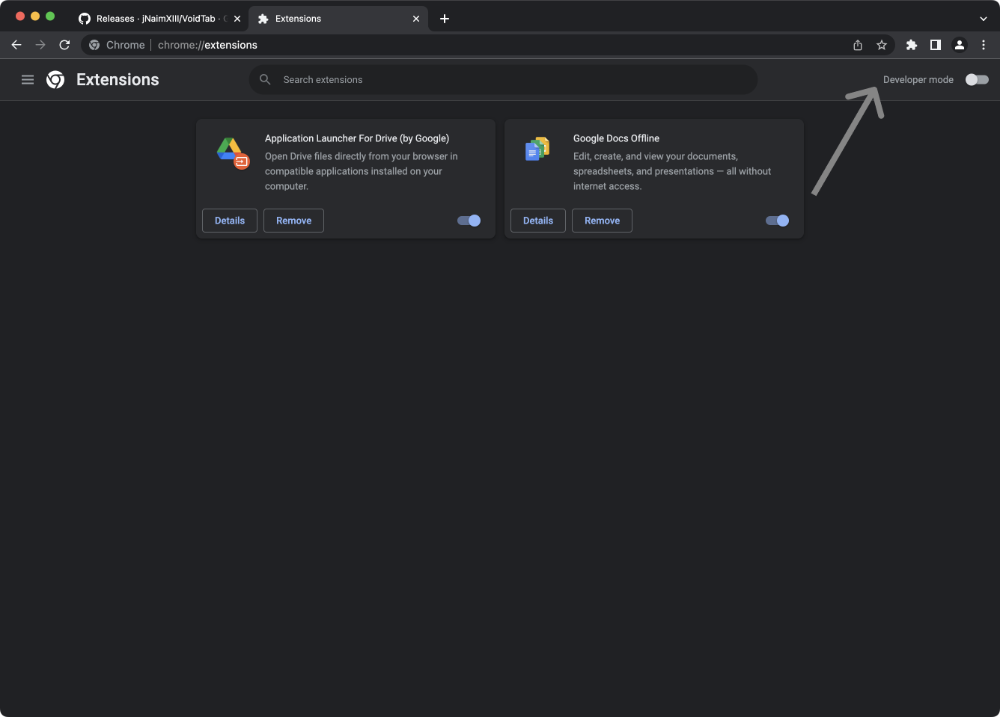

A void / blank page for your browser's New Tab page. Tired of annoying items and menus in your home screen? Try VoidTab.
It literally is a blank page with a solid background. You can customize that background to match your browser theme.

# Install

Download extension files (source code) from the <a href="https://github.com/jNaimXIII/VoidTab/releases">releases</a> and
extract its contents.

 

Go to Chrome's extensions page.

 

It's similar in all Chromium browsers. Check for specific browser's page links.

- Chrome - `chrome://extensions`
- Edge - `edge://extensions`

Enable Developer Mode

 

Enable Developer Mode

 

Load unpacked extension. Select the extracted folder.

 

Enable / Disable the extension from here.

 

Open a new tab and allow the extension to take over.

 

Go to the extensions menu and pin VoidTab.

 

Open VoidTab menu to customize the colors. Click on either color pickers to choose the color.

 

Update the page colors once selected.

 

Updated Colors

 

Click Reset to restore back to default colors.

 

Reset Colors

 

